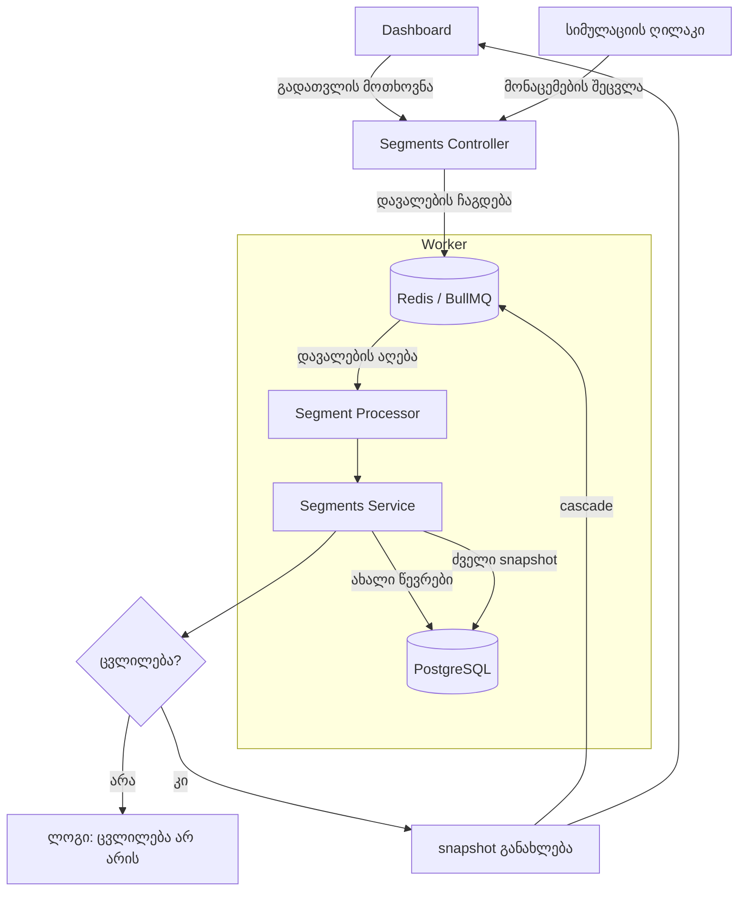

## 1. რას აკეთებს პროექტი?

პროექტის მთავარი მიზანია კლიენტების სეგმენტაციისა და მათში მომხდარი
ცვლილებების მართვა. მთავარი სირთულე ისაა, რომ კლიენტის მონაცემები
(მაგალითად დახარჯული თანხა) მუდმივად იცვლება. შესაბამისად, კლიენტი
შეიძლება ერთ მომენტში VIP იყოს, მეორეში კი აღარ.

ეს პროექტი აგვარებს სამ მთავარ საკითხს:

- სისტემა გვეუბნება ვინ დაემატა და ვინ ამოვარდა სეგმენტიდან წინა
  შემოწმების შემდეგ.
- თუ ათასობით კლიენტის მონაცემი ერთდროულად იცვლება, სისტემა არ
  ცდილობს ათასჯერ გადათვლას, ის აგროვებს ცვლილებებს და პერიოდულად
  ანახლებს სეგმენტებს.
- თუ ერთი სეგმენტი მეორეზეა დამოკიდებული, პირველის განახლება
  ავტომატურად გადაჯაჭვულია მეორეზეც.

---

## 2. როგორ გავუშვათ?

### რა დაგვჭირდება

- **Node.js** (v18+) და **Docker**

### Steps

1. **ინფრასტრუქტურა** — root საქაღალდეში გაუშვით:
   ```bash
   docker-compose up -d
   ```

2. **ბექენდი (NestJS):**
   ```bash
   cd backend
   npm install
   npm run seed
   npm run start:dev
   ```

3. **ფრონტენდი (Angular):**
   ```bash
   cd frontend
   npm install
   npm start
   ```
   URL: `http://localhost:4200`

### Seed Data

| სეგმენტი        | აღწერა                             |
|-----------------|------------------------------------|
| VIP კლიენტები   | ვინც 5 000₾-ზე მეტი დახარჯა      |
| მარტის კამპანია | სტატიკური სია, რომელიც არ იცვლება |
| VIP რისკ ჯგუფი  | ეს სეგმენტი VIP-ზეა დამოკიდებული |

---

## 3. არქიტექტურა



---

## 4. რატომ ეს გზა?

ამ ტასკის კეთებისას რამდენიმე ადგილას მომიწია არჩევანის გაკეთება:
სწრაფი და მარტივი თუ სტაბილური და მომავალში მასშტაბირებადი.

### PostgreSQL ტრიგერი — რატომ არ ავარჩიე

ერთი შეხედვით ყველაზე ლოგიკური ვარიანტი იქნებოდა მონაცემების
ცვლილებაზე პირდაპირ ბაზაშივე ტრიგერის მიბმა, მაგრამ:

- კოდის დონეზე დაწერილ ლოგიკას უფრო მარტივად გაუკეთებ დებაგინგს
- თუ ერთი სეგმენტის შეცვლა მეორის გადათვლას იწვევს, ტრიგერებმა
  შეიძლება უსასრულო ციკლი შექმნას.
- ბაზიდან რთულია ფრონტენდს შეატყობინო რომ რაღაც შეიცვალა.

### 5 წამიანი დაყოვნება

თუ ათასობით კლიენტის მონაცემი ერთდროულად იცვლება, სისტემამ
ათასჯერ უნდა გადაითვალოს სეგმენტი. ამიტომ გამოვიყენე 5 წამიანი
დაყოვნება

### Snapshot

იმისთვის, რომ სხვაობა მეპოვა, გადავწყვიტე შემენახა snapshot-ები
(კონკრეტულ მომენტში სეგმენტის წევრების სია).

**პლუსი:**
snapshot-ის გარეშე მხოლოდ იმის გაგებას შევძლებდით, თუ ვინ არის სეგმენტში
მიმდინარე მომენტში. ეს მიდგომა გვაძლევს საშუალებას ძველი და ახალი სია შევადაროთ ერთმანეთს.

**მინუსი:**
snapshot-ები ბაზაში ადგილს იკავებს. მილიონობით კლიენტის
შემთხვევაში ეს საკმაოდ დიდი მოცულობაა

### კასკადური განახლება

სეგმენტები ისე ავაწყვეე რომ ერთის შეცვლა ავტომატურად გადაჯაჭვულია
მეორე სეგმენტზე.თუ კლიენტი
გახდა VIP, ის ავტომატურად შეიძლება მოხვდეს რისკ-ჯგუფშიც.

### Bonus

ასევე ინტეგრირებულია სიმულაციის ლოგიკა. ყოველი ცვლილების
აღმოჩენისას `SegmentsService` ავტომატურად აფიქსირებს ახალ წევრებს
და ბექის ლოგებში აგზავნის შეტყობინებას.
